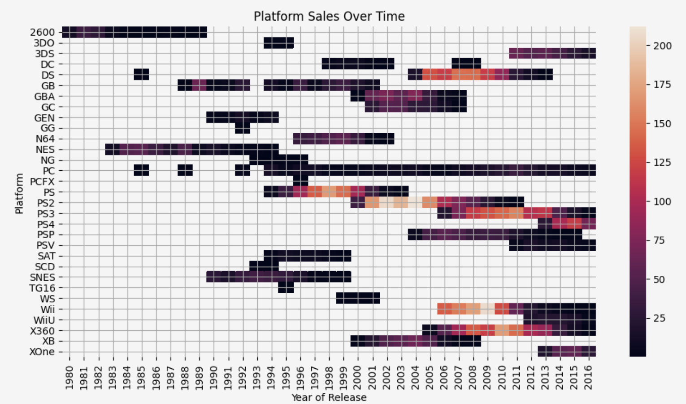
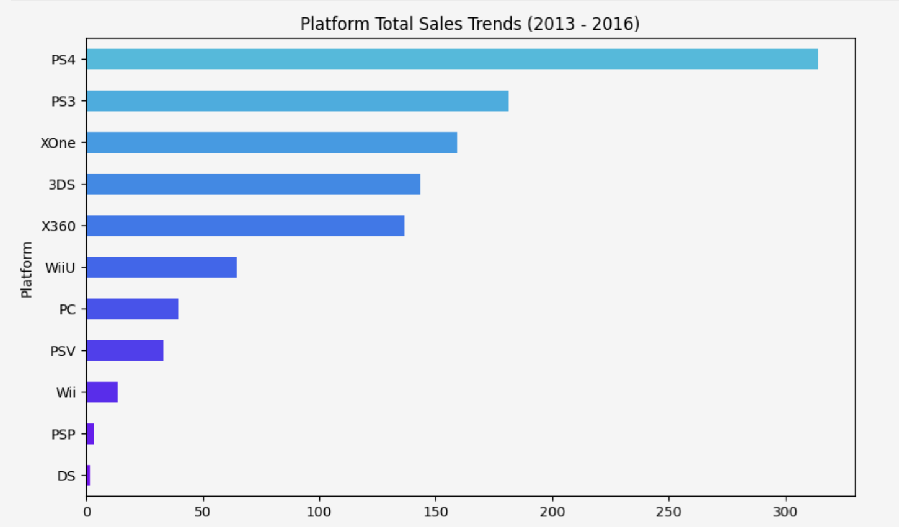
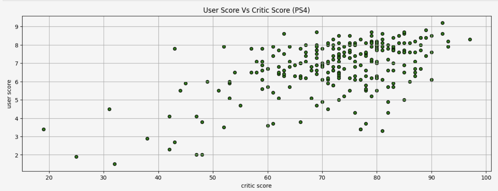
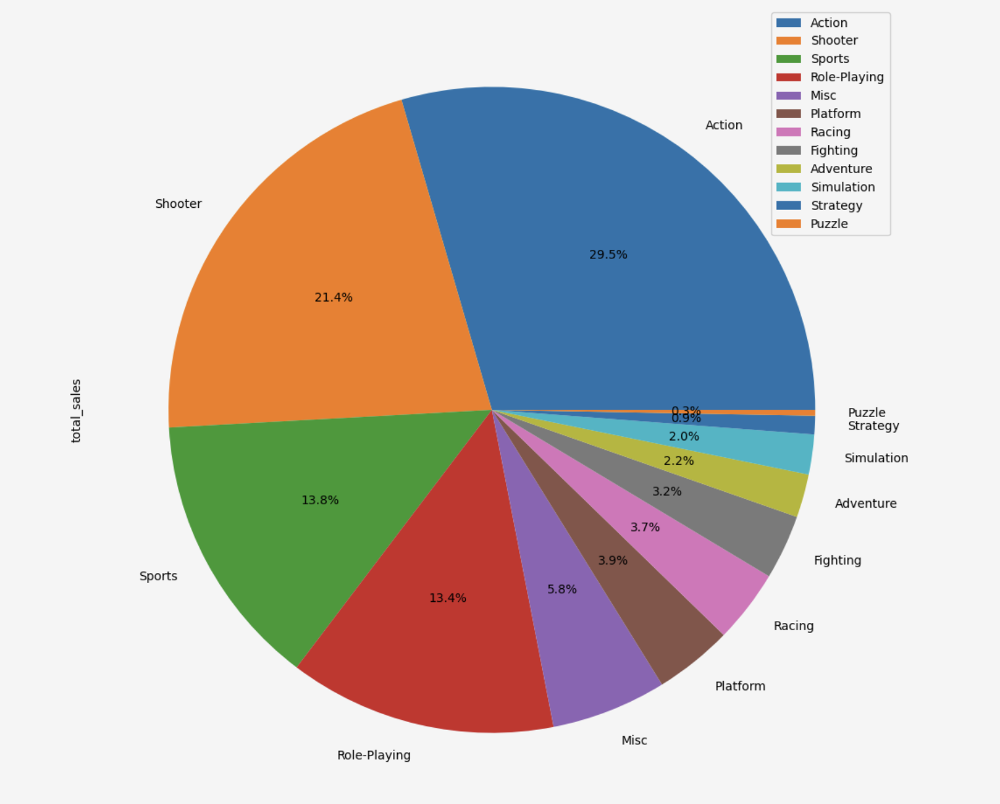

# Video Game Sales Forecasting
By James Weaver

## Introduction
This project focuses on analyzing historical video game sales data for the online store **Ice**. The objective is to identify underlying patterns that determine whether a game succeeds or fails, allowing the commercial department to spot potential big winners and optimize advertising campaigns for the year 2017. The analysis is based on open-source data encompassing user and expert reviews, genres, platforms, and regional sales. 

## Files
1. **Video_Game_Sales_Analysis.ipynb** The main Jupyter Notebook containing the code for data cleaning, total sales calculations, exploratory data analysis (EDA), regional profiling, and statistical hypothesis testing.
2. **games.csv** The primary dataset containing information on game names, platforms, release years, genres, regional sales (NA, EU, JP, Other), critic/user scores, and ESRB ratings.
3. **README.md** Overview of the project, methodology, tools used, and key findings.

## Approach
1. **Data Preparation**
   - Standardized column names by converting them to lowercase.
   - Converted data to appropriate types (e.g., `user_score` to numeric, `year_of_release` to integer).
   - Handled missing values by treating "tbd" (to be determined) as null values and filling missing names/genres with "unknown" to preserve data integrity.
2. **Data Enrichment**
   - Calculated the total global sales for each game by summing sales across North America, Europe, Japan, and other regions.
3. **Exploratory Data Analysis (EDA)**
   - Analyzed the distribution of game releases across different years to identify market peaks and declines.
   - Visualized platform sales over time to map out the typical lifecycle of a gaming platform, which was found to be between 4 to 11 years.
   - Filtered the dataset to a relevant time period (**2013–2016**) to ensure predictions for 2017 were based on current market conditions.
4. **Behavioral & Regional Analysis**
   - Compared global sales across platforms and evaluated the correlation between critic/user reviews and sales performance.
   - Created distinct user profiles for the NA, EU, and JP regions by analyzing their top platforms, preferred genres, and the impact of ESRB ratings on sales.
5. **Statistical Hypothesis Testing**
   - Tested datasets for normality using Shapiro-Wilk tests and Q-Q plots.
   - Formulated null and alternative hypotheses to test if average user ratings differ between Xbox One and PC platforms, and between Action and Sports genres.

## Tools Used
- **Python**: Core programming and data processing.
- **Pandas**: Data manipulation, cleaning, and aggregation.
- **NumPy**: Numerical operations.
- **Matplotlib / Seaborn**: Creating heatmaps, scatter plots, box plots, and bar charts to visualize sales distributions and trends.
- **SciPy / Stats**: Performing statistical tests (e.g., Shapiro-Wilk) and probability plots.

## Key Findings
1. **Market Trends & Lifecycle**
   - The video game market saw its peak release years between **2002 and 2011**, followed by a noticeable decline.
   - The typical lifespan of a gaming platform is between **4 to 11 years**, with most platforms eventually fading from the market as new technology emerges.
2. **Platform Performance (2013-2016)**
   - The top 4 platforms driving recent sales were the **PS4, PS3, XOne, and 3DS**.
   - The **PS4** showed the strongest growth, with sales nearly tripling from 2013 to 2014 (a **284.76%** increase), while older platforms like the PSP and Wii saw sharp declines.
3. **Review Score Impact**
   - Critic scores are a better predictor of commercial success than user scores. For the PS4, critic scores showed a positive correlation of **0.40** with global sales, whereas user scores had a slightly negative correlation of **-0.03**.
4. **Genre Profitability**
   - **Action** and **Shooter** games dominate the global market. From 2013 to 2016, Action games generated **321.87 million** in sales, and Shooters generated **232.98 million**.
   - Genres like Strategy, Simulation, and Puzzle have much lower average sales and make up a very small share of the market.
5. **Regional User Profiles**
   - **North America & Europe:** These regions share similar tastes, heavily favoring Western home consoles (**PS4, XOne, X360**) and **Action/Shooter** games. **M-rated** (Mature) games drive the highest sales by a large margin in these regions.
   - **Japan:** The Japanese market is distinctly different, favoring portable consoles like the **3DS** (which leads by a wide margin) and **Role-Playing** games. **T-rated** (Teen) games perform best in Japan.

## Visuals
### Platform Sales Over Time (Lifecycle Heatmap)

### Platform Global Sales Trends (2013-2016)

### Critic Score vs Global Sales (PS4)

### Genre Sales Distribution

## Recommendations
1. **Prioritize Next-Gen Consoles for 2017**
   - Advertising budgets should focus heavily on games developed for the **PS4** and **Xbox One**, as these are the most dominant and stable platforms in the current market cycle.
2. **Tailor Marketing Campaigns by Region**
   - In North America and Europe, marketing should highlight **Action** and **Shooter** titles, particularly those with an **M-rating**.
   - In Japan, campaigns must pivot to target the **3DS** platform and **Role-Playing** games with **T-ratings** or **E-ratings**.
3. **Leverage Critic Reviews in Promotions**
   - Since critic scores have a stronger correlation with high sales compared to user scores, games that receive high professional marks should feature those scores prominently in their 2017 advertising materials.

## Future Improvements
- Expand the analysis to include the impact of specific game publishers or franchises on long-term sales retention.
- Apply machine learning predictive models (e.g., Random Forest or Linear Regression) to forecast exact global sales figures for upcoming 2017 titles based on their platform, genre, and preliminary critic scores.
- Analyze seasonal sales trends (e.g., holiday spikes) to better time the launch of specific advertising campaigns.
